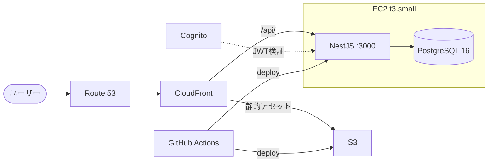

# uma-crown-simulator

**https://umacrownsimulator.com**

ウマ娘の全冠達成を支援する Web アプリケーション。
対象レース 164 個に対し 1 育成で出走できるターンは 59 しかないため、適性・シナリオ制約を考慮した最適な育成ローテーションパターンを自動計算し複数提案します。

## 本番アーキテクチャ


```mermaid
graph LR
    User([ユーザー]) --> Route53[Route 53]
    Route53 --> CF[CloudFront]

    CF -- 静的アセット --> S3[S3]
    CF -- /api/ --> NestJS

    subgraph EC2 [EC2 t3.small]
        NestJS[NestJS :3000]
        PG[(PostgreSQL 16)]
        NestJS --> PG
    end

    Cognito[Cognito] -. JWT検証 .-> NestJS
    GHA[GitHub Actions] -- deploy --> S3
    GHA -- deploy --> NestJS
```

Terraform による IaC 管理。

## 技術スタック

### フロントエンド
- **Framework**: Angular 21
- **Language**: TypeScript
- **Styling**: Tailwind CSS v4
- **Build**: esbuild (`@angular/build:application`)
- **Lint**: ESLint (angular-eslint + typescript-eslint)
- **Test**: Vitest + カバレッジ閾値 90%

### バックエンド
- **Framework**: NestJS
- **Language**: TypeScript
- **ORM**: Prisma
- **Database**: PostgreSQL 16
- **Authentication**: Amazon Cognito (JWT)
- **Lint**: ESLint (typescript-eslint)
- **Test**: Jest + カバレッジ閾値 80〜90%

### インフラ
- **パッケージ管理**: npm workspaces (モノレポ)
- **共有型定義**: `shared/` パッケージ
- **IaC**: Terraform
- **ホスティング**: AWS（CloudFront + S3 + ECS on EC2）
- **CI/CD**: GitHub Actions (OIDC)

## プロジェクト構成

```
uma-crown-simulator/
├── frontend/    # Angular フロントエンド
├── backend/     # NestJS バックエンド
├── shared/      # 共有型定義 (@uma-crown/shared)
├── terraform/   # IaC (Terraform)
├── docs/        # ドキュメント
├── k8s/         # Kubernetes マニフェスト (ローカル開発用)
└── prompts/     # AI 向けコンテキスト・プロンプト集
```

## ドキュメント

### 全体

| ドキュメント | 内容 |
|------------|------|
| [docs/architecture.md](docs/architecture.md) | アプリケーション内部構成・モジュール詳細・ER図 |
| [docs/development.md](docs/development.md) | 開発環境セットアップ・テスト・ビルド手順 |
| [docs/history.md](docs/history.md) | リプレイス履歴・技術選定の理由 |

### バックエンド

| ドキュメント | 内容 |
|------------|------|
| [docs/algorithm.md](docs/algorithm.md) | 育成パターン計算アルゴリズム |
| [docs/testing.md](docs/testing.md) | テスト構成・シナリオ詳細 |

### インフラ

| ドキュメント | 内容 |
|------------|------|
| [docs/infrastructure.md](docs/infrastructure.md) | AWS インフラ構成・Terraform デプロイ手順 |

## AI プロンプト群

`prompts/` ディレクトリに Claude Code 向けのコンテキスト・規約を集約しています。

| ファイル | 内容 |
|---------|------|
| `prompts/system.md` | プロジェクト概要・技術スタック・設計・ビジネスロジック |
| `prompts/coding-convention/` | コーディング規約（共通・TypeScript・バックエンド・フロントエンド） |
| `prompts/operations.md` | ローカルデプロイ手順・kubectl 操作・npm scripts |
| `prompts/commit.md` | コミットメッセージ規約 |
