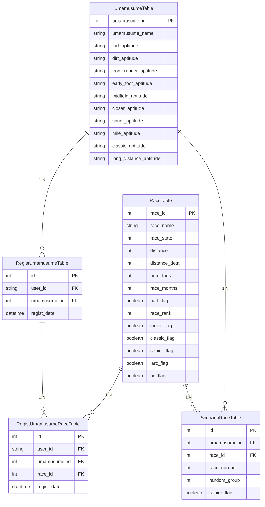

# アーキテクチャ

## システム構成図

```
                    ユーザー (ブラウザ)
                          │
                       Route53
                          │
                         ACM
                          │
                     CloudFront
                     ┌────┴────┐
                     │         │
                    S3       /api/*
                  (静的)        │
                           EC2 (t3.small)
                           ┌────┴────────────────┐
                          ECS                  Docker
                           │                    │
                       NestJS              PostgreSQL
                      (タスク)            (コンテナ + EBS)
```

CloudFront がエントリポイントとなり、静的ファイル（Angular ビルド成果物）は S3 から配信、
`/api/*` へのリクエストは EC2 上の ECS（NestJS）に転送します。

## アプリケーション内部構成

```
┌─────────────────────────────────────────────────────────┐
│                     Client (Browser)                    │
└──────────────────────────┬──────────────────────────────┘
                           │
┌──────────────────────────▼──────────────────────────────┐
│              Frontend (nginx / Angular)                 │
│  ┌─────────────┐  ┌──────────────┐  ┌───────────────┐  │
│  │  AuthGuard   │  │  HttpClient  │  │   Cognito SDK │  │
│  │  (Router)    │  │ (Interceptor)│  │  (SignIn/Up)  │  │
│  └─────────────┘  └──────┬───────┘  └───────────────┘  │
└──────────────────────────┼──────────────────────────────┘
                  /api/*   │  CloudFront → EC2
┌──────────────────────────▼──────────────────────────────┐
│               Backend (NestJS)                          │
│  ┌──────────┐  ┌───────────┐  ┌──────────────────────┐  │
│  │AuthGuard │  │ Cognito   │  │  Feature Modules     │  │
│  │(Global)  │──│ Verifier  │  │  ┌────────────────┐  │  │
│  └──────────┘  └───────────┘  │  │  Umamusume     │  │  │
│                               │  │  Race           │  │  │
│                               │  │  RacePattern    │  │  │
│                               │  └────────────────┘  │  │
│                               └──────────┬───────────┘  │
│                                          │ Prisma ORM   │
└──────────────────────────────────────────┼──────────────┘
┌──────────────────────────────────────────▼──────────────┐
│                   PostgreSQL 16                         │
└─────────────────────────────────────────────────────────┘
```

フロントエンドとバックエンドで TypeScript + `@shared/types` を共有し API の型安全性を担保。
認証は Amazon Cognito に委譲し、バックエンドでは JWT トークンの検証のみを行うステートレスな構成です。

## モジュール詳細

### `shared/` — 共有型定義パッケージ

npm workspaces で `@uma-crown/shared` として公開。フロントエンド・バックエンド間で共通の
インターフェースを定義し、API の入出力に対する型安全性を保証します。

主な型: `Umamusume`, `Race`, `RemainingRace`, `RacePattern`, `RaceSlot`, `LoginRequest`, `AuthResponse` 等

### `frontend/src/app/core/` — アプリケーション基盤層

認証に関する横断的関心事を集約。`AuthService` は Angular Signals でトークン状態をリアクティブに管理し、
`HttpInterceptor` が全リクエストに Bearer トークンを自動付与します。

### `frontend/src/app/features/` — 機能モジュール群

各機能は遅延読み込み (Lazy Loading) で分割され、初期バンドルサイズを最適化しています。

| モジュール | 概要 |
|-----------|------|
| `landing/` | 未ログイン時のトップページ |
| `auth/` | Cognito ベースのログイン・ユーザー登録・パスワードリセット |
| `character-regist/` | 未登録ウマ娘の選択と初期レース完了状態の一括登録 |
| `character-list/` | 登録済みウマ娘の一覧と適性情報のビジュアル表示 |
| `race-list/` | 全レース一覧（馬場・距離フィルタ付き、未認証でもアクセス可） |
| `remaining-race/` | 全冠達成に向けた残レース管理・育成パターン提案・手動レース登録 |

### `backend/src/common/` — 横断的関心事

`@Public()` デコレータで個別エンドポイントの認証スキップを宣言的に制御します。

### `backend/src/race/` — レース管理モジュール

本アプリケーションのコアロジック。`RacePatternService` が全冠達成に向けた育成ローテーションを生成します。
詳細は [algorithm.md](algorithm.md) を参照。

## ER図


